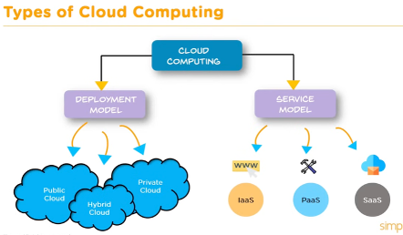
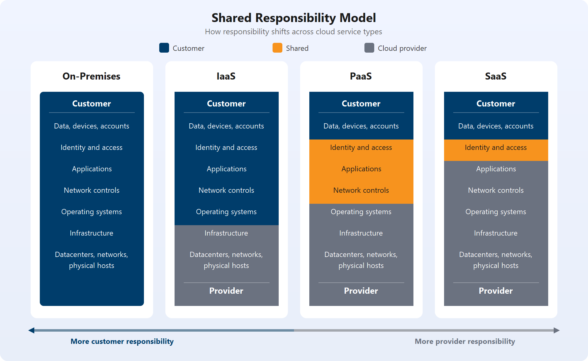
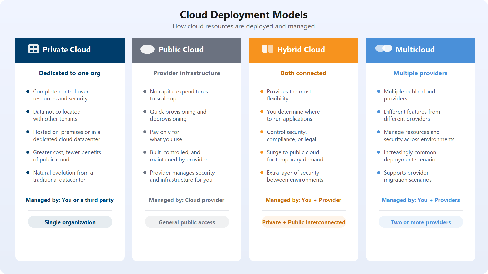
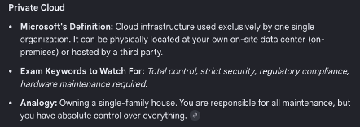
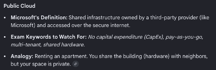
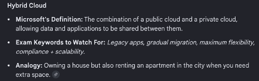
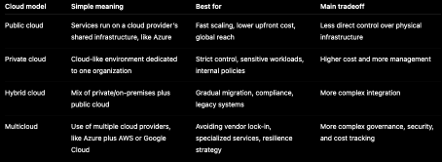

# Microsoft Certified: Azure Fundamentals

## Introduction to Cloud Infrastructure: Describe Cloud Concepts

### Describe Cloud Computing

Cloud computing refers to IT services that are delivered over the internet instead of being hosted only in physical datacenters owned by an organization. In the cloud, you can use infrastructure and technology services such as:

- Virtual machines
- Networking
- Storage
- Databases
- Internet of Things (IoT)
- Machine learning
- Artificial intelligence

These services run in the cloud provider's datacenters, which allows organizations to use only the resources they need and pay only for what they consume.

### Shared Responsibility Model

The shared responsibility model defines how security and operational responsibilities are divided between the cloud provider and the customer. The amount of responsibility you manage depends on the cloud service model you use:

- Infrastructure as a Service (IaaS)
- Platform as a Service (PaaS)
- Software as a Service (SaaS)

- **IaaS (Infrastructure as a Service):** You manage virtual machines, operating systems, and applications. Examples include Azure Virtual Machines, Azure Disk Storage, and virtual networks.
- **PaaS (Platform as a Service):** You deploy applications without managing virtual machines or operating systems. Examples include Azure App Service, Azure Functions, Azure SQL Database, and Azure Storage.
- **SaaS (Software as a Service):** You use ready-made applications. Examples include Microsoft 365, Dynamics 365, and other cloud applications.

When using a cloud provider, you are always responsible for:

- The information and data stored in the cloud
- The devices that are allowed to connect to your cloud resources, such as phones and computers
- The accounts and identities of people, services, and devices in your environment

The cloud provider is always responsible for:

- The physical datacenter
- The physical network
- The physical hosts

Your service model determines responsibility for areas such as:

- Operating systems
- Network controls
- Applications
- Identity and access
- Infrastructure

### Cloud Models

Cloud deployment models define where cloud resources are hosted and how they are accessed.

#### Private Cloud

In a private cloud, cloud resources are used exclusively by a single business or organization. A private cloud can be physically located in the organization's on-site datacenter or hosted on third-party infrastructure. This model offers the highest level of control and security.

Examples include:

- VMware Private Cloud
- Red Hat OpenShift
- IBM Cloud Satellite

#### Public Cloud

In a public cloud, the infrastructure is owned, operated, and managed by a third-party provider and delivered over the public internet.

Examples include:

- Amazon Web Services (AWS)
- Microsoft Azure
- Google Cloud

#### Hybrid Cloud

A hybrid cloud physically or logically connects a private cloud with one or more public clouds, allowing data and applications to be shared between them.

Examples include:

- AWS Outposts
- Azure Arc
- Google Cloud Anthos

#### Multicloud

Multicloud is a deployment model in which a company uses multiple public cloud providers instead of relying on only one provider or combining public and private cloud environments. Organizations may use a multicloud strategy to avoid vendor lock-in, use best-of-breed services from different providers, or reduce costs.

For example, a company might use AWS for storage, Google Cloud for machine learning, and Microsoft Azure for Active Directory services.

### Consumption-Based Model

Cloud computing commonly uses a consumption-based pricing model, which means you pay only for the IT resources you use.

In traditional IT budgeting, costs are often categorized as capital expenditure or operational expenditure:

- **Capital Expenditure (CapEx):** Up-front spending on physical infrastructure such as servers, network hardware, and datacenter space.
- **Operational Expenditure (OpEx):** Ongoing spending on services over time.

A private cloud usually requires Capital Expenditure (CapEx) because an organization must purchase physical servers and infrastructure up front.

Public cloud services are usually classified as Operational Expenditure (OpEx) because you pay only for what you use over time.
